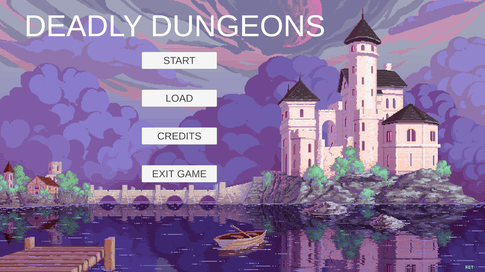
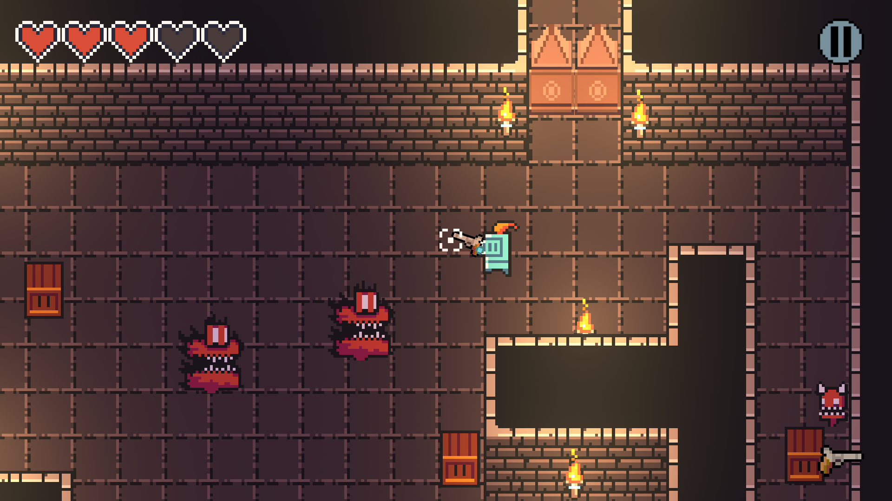
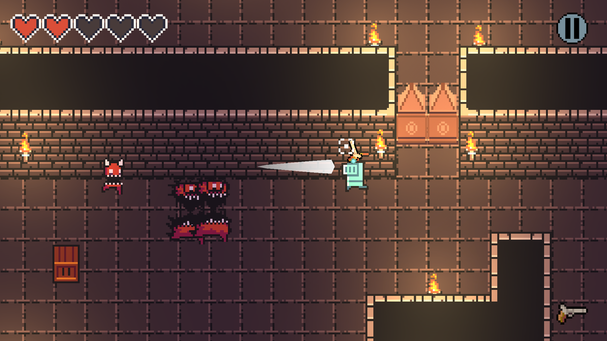
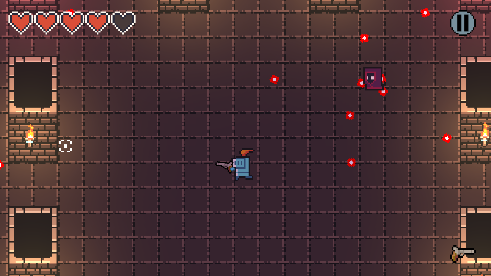

# Deadly Dungeons

## Description

Dungeon Explorer is an exciting 2D pixel art game where players venture through dungeons filled with challenging enemies and bosses. Armed with a powerful arsenal and a special dodging ability, players must progress through different levels, face hordes of enemies, and defeat epic bosses.

---

## Screenshots

Here a some gameplay screenshots that include the game main menu, combat, dash. and boss-fight.

---

## Controls

- **Movement:** Arrow keys or WASD
- **Shoot:** Left mouse button
- **Dash:** Spacebar

---

## Credits

### Music

- **Underworld:** John Preston
- **Hero_Inmortal:** Trevor Lentz
- **Old City Theme:** remaxim

### Scene Backgrounds

- **Pixel Castle:** FromFable
- **The End Thanks For Playing:** Pirate-Pringles
- **8-bit pixel text, game over:** Rina Maryana

### Assets

- **RPG Essentials Sound Effects - FREE!:** leohpaz
- **Dungeon Tileset Assets (animations and controllers):** wizards
- **Dungeon Tileset II - Extended:** Niji
- **Snake's Authentic Gun Sounds:** SnakeF8
- **FreeSound - paind.wav:** Michel88

---

## Installation

1. Clone the repository: `git clone https://github.com/your_username/DungeonExplorer.git`
2. Open the project in Unity.
3. Ready to play!

---

## Course information

 CI0136 - Diseño de Software

Universidad de Costa Rica

Escuela de Ciencias de la Computación e Informática

Second half 2023

---

## Developer Notes

We appreciate your interest in Dungeon Explorer. If you encounter issues or have suggestions, feel free to contact us. Have fun exploring the dungeons!

---

*This game was developed by Harold Carrillo (C08866), Elías Jiménez (C03953), and Daniel Van der Laat (B88144), and uses assets created by talented independent artists and musicians.*

**Thank you for playing Dungeon Explorer!**

